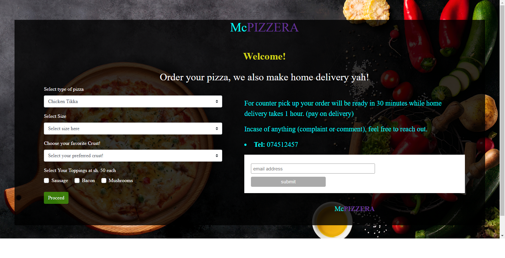

# Pizza inn
#### A mock webpage for a fictional pizza joint called McPIZZERA studio hosted in git hub, 4 August 2020
#### By **Charles N. Mailu**
## Description

This is a fictional pizza in for practice  of week four objects, javavascript, jquery and css, at moringa school prep class 

## Setup/Installation Requirements

* Text editor atom or visual studio
* install git and an account at git hub
* web browser chrome or firefox
* Fork the repo
* Create a new branch (git checkout -b improve-feature)
* Make the appropriate changes in the files
* Add changes to reflect the changes made
* Commit your changes (git commit -am 'Improve feature')
* Push to the branch (git push origin improve-feature)
* Create a Pull Request

**layout**
*   

## Known Bugs
the webpage on select of pizza without all details still prints out the zero amount and causes double alerts to pop up after u enter correct details, it is beeing corrected for support kindly reach me at <a href="https://charlesmaillu.github.io/contact-info">here</a> 
## Technologies Used
* HTML
* CSS
* java script
* jquery
* Bootstrap
## Support and contact details
If you run into any issues or have questions, ideas or concerns to reach me click <a href="https://charlesmaillu.github.io/contact-info">here</a>

Want to contribute? Great!

To fix a bug or enhance an existing module, follow these steps:

* Fork the repo
* Create a new branch (git checkout -b improve-feature)
* Make the appropriate changes in the files
* Add changes to reflect the changes made
* Commit your changes (git commit -am 'Improve feature')
* Push to the branch (git push origin improve-feature)
* Create a Pull Request

### Setup
clone this repo to your desktop and run 
### License
This project is licensed under the terms of the MIT license. To check license click <a href="https://github.com/charlesmaillu/mc-pizza/blob/master/license">here</a>
 **Charles Mailu**                  
